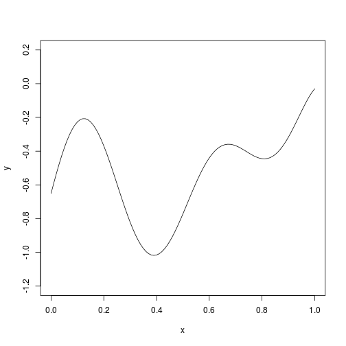
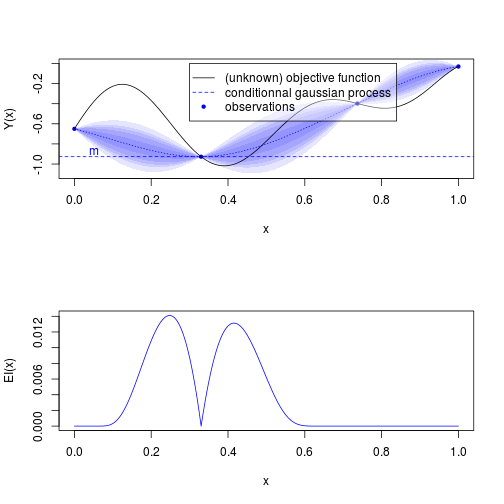
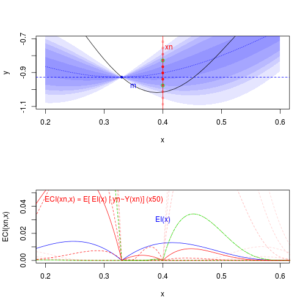
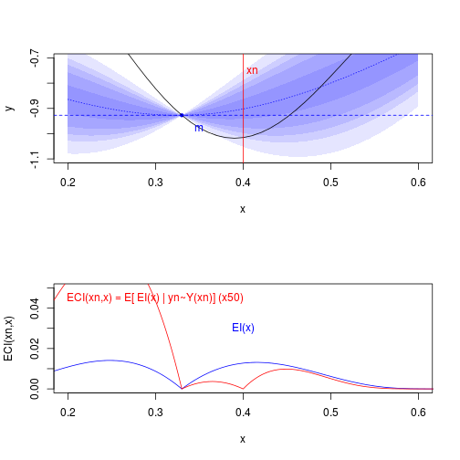
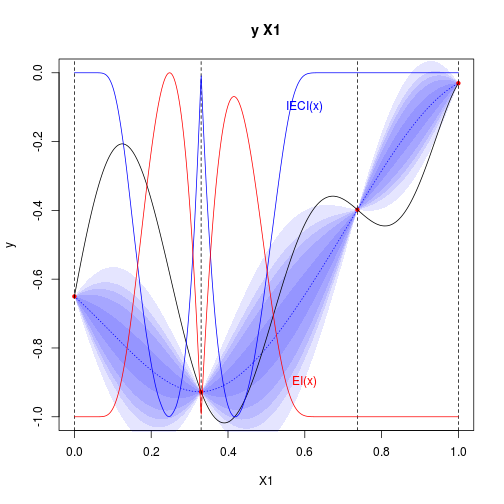

# Integrated Expected Conditional Improvement

These R files contains an analytical implementation of the criterion "IECI" proposed for Optimization under unknown constraints (2010) by [Robert Gramacy and Herbert Lee](http://arxiv.org/pdf/1004.4027v2.pdf). 

This implementation is based on [DiceKriging](https://cran.r-project.org/web/packages/DiceKriging/index.html) R package.

## R usage

Objective function


```r
fun=function(x){-(1-1/2*(sin(12*x)/(1+x)+2*cos(7*x)*x^5+0.7))}

plot(fun,type='l',ylim=c(-1.2,0.2),ylab="y")
```

 

```r
X=data.frame(X=matrix(c(.0,.33,.737,1),ncol=1))
y=fun(X)
```

Expected Improvement (EI)


```r
par(mfrow=c(2,1))

library(DiceKriging)
set.seed(123)
kmi <- km(design=X,response=y,control=list(trace=FALSE),optim.method = 'gen')
```

```
## Warning in (function (fn, nvars, max = FALSE, pop.size = 1000,
## max.generations = 100, : NAs introduits lors de la conversion automatique
```

```r
library(DiceView)
sectionview.km(kmi,col_surf='blue',col_points='blue',xlim=c(0,1),ylim=c(-1.1,0),title = "",Xname = "x",yname="Y(x)")
plot(fun,type='l',add=T)
abline(h=min(y),col='blue',lty=2)
text(labels="m",x=0.05,y=min(y)+0.05,col='blue')
legend(bg = rgb(1,1,1,.4),0.3,0,legend = c("(unknown) objective function","conditionnal gaussian process","observations"),col=c('black','blue','blue'),lty = c(1,2,0),pch = c(-1,-1,20))

source("EI.R")
.xx=seq(f=0,t=1,l=501)
plot(.xx,EI(.xx,kmi),col='blue',type='l',xlab="x",ylab="EI(x)")
```

 

Expected Conditional Improvement (ECI) by Monte Carlo estimation (! slow !)


```r
par(mfrow=c(2,1))

xn=0.4

sectionview.km(kmi,col_surf='blue',col_points='blue',xlim=c(xn-0.2,xn+0.2),ylim=c(-1.1,-.7),title = "",Xname = "x")
plot(fun,type='l',add=T)
abline(h=min(y),col='blue',lty=2)
text(labels="m",x=0.35,y=min(y)-0.05,col='blue')


abline(v=xn,col='red')
text(labels="xn",x=xn+0.01,y=-0.75,col='red')

Yn=predict.km(kmi,newdata=xn,type="UK",checkNames = F)
.yy = seq(f=Yn$lower,t=Yn$upper,l=11)
#lines(x=dnorm(.xxx,yn$mean,yn$sd)/100+xn,y=.xxx,col='red')
points(x=rep(xn,length(.yy)),y=.yy,col=rgb(1,0,0,0.2+0.8*dnorm(.yy,Yn$mean,Yn$sd)*sqrt(2*pi)*Yn$sd),pch=20)
points(x=xn,y=.yy[8],col=rgb(0,1,0),pch=1)
points(x=xn,y=.yy[4],col=rgb(0,1,0),pch=1)

plot(.xx,EI(.xx,kmi),col='blue',type='l',xlab="x",ylab="ECI(xn,x)",xlim=c(xn-0.2,xn+0.2),ylim=c(0,0.05))
text(labels="EI(x)",x=.4,y=0.03,col='blue')

for (yn in .yy) {
  kmii <- km(design=rbind(X,xn),response=rbind(y,yn),control = list(trace=FALSE))
  lines(.xx,5*EI(.xx,kmii),col=rgb(1,0,0,0.2+0.8*dnorm(yn,Yn$mean,Yn$sd)*sqrt(2*pi)*Yn$sd),lty=2)
}
yn = .yy[8]
kmii <- km(design=rbind(X,xn),response=rbind(y,yn),control = list(trace=FALSE))
lines(.xx,5*EI(.xx,kmii),col=rgb(0,1,0),lty=2)
yn = .yy[4]
kmii <- km(design=rbind(X,xn),response=rbind(y,yn),control = list(trace=FALSE))
lines(.xx,5*EI(.xx,kmii),col=rgb(0,1,0),lty=6)

source("IECI_mc.R",echo = FALSE)
lines(.xx,Vectorize(function(.x)5*ECI_mc_vec.o2(.x,xn,kmi))(.xx),col='red',type='l')
text(labels="ECI(xn,x) = E[ EI(x) | yn~Y(xn)] (x50)",x=.3,y=0.045,col='red')
```

 


Expected Conditional Improvement (ECI) by exact calculation (! fast !)


```r
par(mfrow=c(2,1))

sectionview.km(kmi,col_surf='blue',col_points='blue',xlim=c(xn-0.2,xn+0.2),ylim=c(-1.1,-.7),title = "",Xname = "x")
plot(fun,type='l',add=T)
abline(h=min(y),col='blue',lty=2)
text(labels="m",x=0.35,y=min(y)-0.05,col='blue')


abline(v=xn,col='red')
text(labels="xn",x=xn+0.01,y=-0.75,col='red')

Yn=predict.km(kmi,newdata=xn,type="UK",checkNames = F)
.yy = seq(f=Yn$lower,t=Yn$upper,l=11)
#lines(x=dnorm(.xxx,yn$mean,yn$sd)/100+xn,y=.xxx,col='red')

plot(.xx,EI(.xx,kmi),col='blue',type='l',xlab="x",ylab="ECI(xn,x)",xlim=c(xn-0.2,xn+0.2),ylim=c(0,0.05))
text(labels="EI(x)",x=.4,y=0.03,col='blue')

source("IECI.R",echo = FALSE)
lines(.xx,5*ECI(matrix(.xx,ncol=1),xn,kmi),col='red',type='l')
```

```
## Warning in ECI(matrix(.xx, ncol = 1), xn, kmi): skipping x[]: 201
```

```
## Warning in ECI(matrix(.xx, ncol = 1), xn, kmi): Some x match x0
```

```r
text(labels="ECI(xn,x) = E[ EI(x) | yn~Y(xn)] (x50)",x=.3,y=0.045,col='red')
```

 


And finally, Integrated Expected Conditional Improvement (IECI) calculated at the point xn: 

```
> IECI_mc(xn,kmi)
[1] 0.002014966
> IECI(xn,kmi)
[1] 0.002115793
```


Overall criterions values (EI and IECI):


```r
par(mfrow=c(1,1))

sectionview.km(kmi,ylim=c(-1,0))
abline(v=X$X,lty=2)

n=function(x){(x-min(x))/(max(x)-min(x))-1}

xx=seq(f=0,t=1,l=1000)
lines(xx,(fun(xx)),type='l')

lines(xx,n(IECI(x0 = xx,model = kmi,lower=0,upper=1)),type='l',col='blue')
```

```
## Warning in ECI(x = integration.points, x0 = x0, model = model, precalc.data
## = precalc.data, : 100
```

```
## Warning in ECI(x = integration.points, x0 = x0, model = model, precalc.data
## = precalc.data, : 100
```

```
## Warning in ECI(x = integration.points, x0 = x0, model = model, precalc.data
## = precalc.data, : 1,1000
```

```
## Warning in ECI(x = integration.points, x0 = x0, model = model, precalc.data
## = precalc.data, : 100 2
```

```
## Warning in ECI(x = integration.points, x0 = x0, model = model, precalc.data
## = precalc.data, : 0,2
```

```r
text(labels="IECI(x)",x=0.6,y=0.9-1,col='blue')

lines(xx,n(EI(xx,model=kmi)),col='red')
text(labels="EI(x)",x=0.6,y=0.1-1,col='red')
```

 


## Analytical development of IECI:


### Computable form of ECI

ECI is viewed in two main parts : updated realizations where the new conditional point 

 is below current minimum 

, and updated realizations where the new conditional point 

 is over current minimum 

 (which then does not change this current minimum for EI calculation):


* 

 part: 


 


Change variable: 


  -  


  -  


  -  


  
So,


Considering that ([@KrigingUpdate]),


Finally, 


Given,


* 

 part: 


Change variable: 


  -  


  -  


  -  


So,


Finally, 


Given,


These integrals need the following expressions to become tractable:

* 


* 


We have (see below):


And


It should be noticed that this exact calculation of ECI is vectorizable, which means that synchronized computations may be performed in an efficient manner.


### Detailed calculation of integrals in 

 and 


#### 


#### 


Changing variable: 

,


   * Then, 


    


   * And, 


  We use the bi-normal cumulative density approximation [@Genz1992]: 
  


  Changing variable 

, 


and thus, 


 


