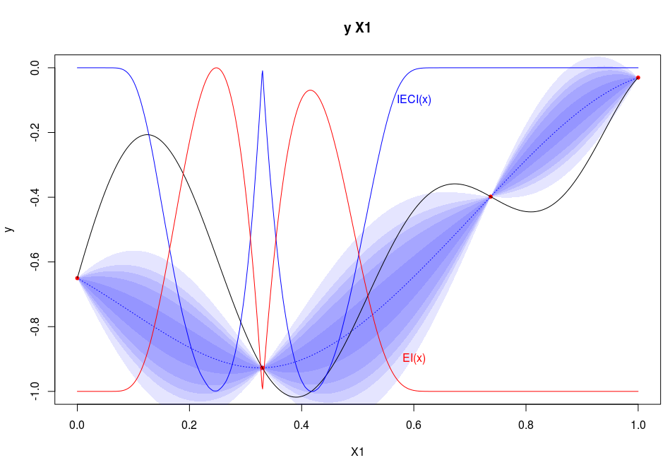

These R files contains an analytical implementation of the criterion "IECI" proposed for Optimization under unknown constraints (2010) by [Robert Gramacy and Herbert Lee](http://arxiv.org/pdf/1004.4027v2.pdf). 

This implementation is based on [DiceKriging](https://cran.r-project.org/web/packages/DiceKriging/index.html) R package.

# R usage

Objective function

```{r}
fun=function(x){-(1-1/2*(sin(12*x)/(1+x)+2*cos(7*x)*x^5+0.7))}

plot(fun,type='l',ylim=c(-1.2,0.2),ylab="y")

X=data.frame(X=matrix(c(.0,.33,.737,1),ncol=1))
y=fun(X)
```

Expected Improvement (EI)

```{r}
par(mfrow=c(2,1))

library(DiceKriging)
set.seed(123)
kmi <- km(design=X,response=y,control=list(trace=FALSE),optim.method = 'gen')

library(DiceView)
sectionview.km(kmi,col_surf='blue',col_points='blue',xlim=c(0,1),ylim=c(-1.1,0),title = "",Xname = "x",yname="Y(x)")
plot(fun,type='l',add=T)
abline(h=min(y),col='blue',lty=2)
text(labels="m",x=0.05,y=min(y)+0.05,col='blue')
legend(bg = rgb(1,1,1,.4),0.3,0,legend = c("(unknown) objective function","conditionnal gaussian process","observations"),col=c('black','blue','blue'),lty = c(1,2,0),pch = c(-1,-1,20))

source("EI.R")
.xx=seq(f=0,t=1,l=501)
plot(.xx,EI(.xx,kmi),col='blue',type='l',xlab="x",ylab="EI(x)")
```


Expected Conditional Improvement (ECI) by Monte Carlo estimation (! slow !)

```{r}
par(mfrow=c(2,1))

xn=0.4

sectionview.km(kmi,col_surf='blue',col_points='blue',xlim=c(xn-0.2,xn+0.2),ylim=c(-1.1,-.7),title = "",Xname = "x")
plot(fun,type='l',add=T)
abline(h=min(y),col='blue',lty=2)
text(labels="m",x=0.35,y=min(y)-0.05,col='blue')


abline(v=xn,col='red')
text(labels="xn",x=xn+0.01,y=-0.75,col='red')

Yn=predict.km(kmi,newdata=xn,type="UK",checkNames = F)
.yy = seq(f=Yn$lower,t=Yn$upper,l=11)
#lines(x=dnorm(.xxx,yn$mean,yn$sd)/100+xn,y=.xxx,col='red')
points(x=rep(xn,length(.yy)),y=.yy,col=rgb(1,0,0,0.2+0.8*dnorm(.yy,Yn$mean,Yn$sd)*sqrt(2*pi)*Yn$sd),pch=20)
points(x=xn,y=.yy[8],col=rgb(0,1,0),pch=1)
points(x=xn,y=.yy[4],col=rgb(0,1,0),pch=1)

plot(.xx,EI(.xx,kmi),col='blue',type='l',xlab="x",ylab="ECI(xn,x)",xlim=c(xn-0.2,xn+0.2),ylim=c(0,0.05))
text(labels="EI(x)",x=.4,y=0.03,col='blue')

for (yn in .yy) {
  kmii <- km(design=rbind(X,xn),response=rbind(y,yn),control = list(trace=FALSE))
  lines(.xx,5*EI(.xx,kmii),col=rgb(1,0,0,0.2+0.8*dnorm(yn,Yn$mean,Yn$sd)*sqrt(2*pi)*Yn$sd),lty=2)
}
yn = .yy[8]
kmii <- km(design=rbind(X,xn),response=rbind(y,yn),control = list(trace=FALSE))
lines(.xx,5*EI(.xx,kmii),col=rgb(0,1,0),lty=2)
yn = .yy[4]
kmii <- km(design=rbind(X,xn),response=rbind(y,yn),control = list(trace=FALSE))
lines(.xx,5*EI(.xx,kmii),col=rgb(0,1,0),lty=6)

source("IECI_mc.R",echo = FALSE)
lines(.xx,Vectorize(function(.x)5*ECI_mc_vec.o2(.x,xn,kmi))(.xx),col='red',type='l')
text(labels="ECI(xn,x) = E[ EI(x) | yn~Y(xn)] (x50)",x=.3,y=0.045,col='red')
```


Expected Conditional Improvement (ECI) by exact calculation (! fast !)

```{r}
par(mfrow=c(2,1))

sectionview.km(kmi,col_surf='blue',col_points='blue',xlim=c(xn-0.2,xn+0.2),ylim=c(-1.1,-.7),title = "",Xname = "x")
plot(fun,type='l',add=T)
abline(h=min(y),col='blue',lty=2)
text(labels="m",x=0.35,y=min(y)-0.05,col='blue')


abline(v=xn,col='red')
text(labels="xn",x=xn+0.01,y=-0.75,col='red')

Yn=predict.km(kmi,newdata=xn,type="UK",checkNames = F)
.yy = seq(f=Yn$lower,t=Yn$upper,l=11)
#lines(x=dnorm(.xxx,yn$mean,yn$sd)/100+xn,y=.xxx,col='red')

plot(.xx,EI(.xx,kmi),col='blue',type='l',xlab="x",ylab="ECI(xn,x)",xlim=c(xn-0.2,xn+0.2),ylim=c(0,0.05))
text(labels="EI(x)",x=.4,y=0.03,col='blue')

source("IECI.R",echo = FALSE)
lines(.xx,5*ECI(matrix(.xx,ncol=1),xn,kmi),col='red',type='l')
text(labels="ECI(xn,x) = E[ EI(x) | yn~Y(xn)] (x50)",x=.3,y=0.045,col='red')
```


And finally, Integrated Expected Conditional Improvement (IECI) calculated at the point xn: 

```{r}
IECI_mc(xn,kmi)
IECI(xn,kmi)
```


Overall criterions values (EI and IECI):

```{r}
par(mfrow=c(1,1))

sectionview.km(kmi,ylim=c(0,1));
abline(v=X,lty=2)

n=function(x){(x-min(x))/(max(x)-min(x))}

xx=seq(f=0,t=1,l=1000)
lines(xx,(fun(xx)),type='l')

lines(xx,n(IECI(x0 = xx,model = kmi,lower=0,upper=1)),type='l',col='blue')
text(labels="IECI(x)",x=0.6,y=0.9,col='blue')

lines(xx,n(EI(xx,model=kmi)),col='red');
text(labels="EI(x)",x=0.6,y=0.1,col='red')
```




# Analytical development of IECI:

$$IECI(x_n) := \int_{x \in D} \int_{y_n \sim \mathcal{N}(\mu_Y,\sigma_Y)} EI(x | Y(x_n)=y_n) dy_n = \int_{x \in D} ECI(x_n,x) dx$$

## Computable form of ECI

ECI is viewed in two main parts : updated realizations where the new conditional point $y_n$ is below current minimum $m$, and updated realizations where the new conditional point $y_n$ is over current minimum $m$ (which then does not change this current minimum for EI calculation):

$$ECI(x,x_n) = \int_{-\infty}^m EI_{n}^{y_n}(x | Y_n(x_n)=y_n) d\phi_{\mu,\sigma}{y_n} + \int_m^{+\infty} EI_n^{m}(x | Y_n(x_n)=y_n) d\phi_{\mu,\sigma}{y_n}$$

* $y_n>m$ part: 
$$ECI_n^m(x,x_n) := \int_m^{+\infty} EI_n^{m}(x | Y_n(x_n)=y_n) d\phi_{\mu,\sigma}{y_n}$$ 
$$ = \int_m^{+\infty} \left( (m-\mu_n(x)) \Phi \left( \frac{m-\mu_n(x)}{\sigma_n(x)} \right) + \sigma_n(x) \phi \left( \frac{m-\mu_n(x)}{\sigma_n(x)} \right) \right) \frac{e^{-\frac{(y_n-\mu(x_n))^2}{2 \sigma^2(x_n)}}}{\sqrt{2 \pi} \sigma(x_n)} dy_n$$
Change variable: $z := \frac {y_n-\mu(x_n)}{\sigma(x_n)}$
  -  $y_n=\sigma(x_n) z + \mu(x_n)$
  -  $dz = dy_n/\sigma(x_n)$
  -  $y_n \in [m,+\infty[ \sim z \in [m' = (m-\mu(x_n))/\sigma(x_n), + \infty[$
  
So,
$$\frac{m-\mu_n(x)}{\sigma_n(x)} = \frac{m-\mu(x)-\lambda_n^t(x) (y_n-\mu(x_n))} {\sqrt{\sigma^2(x)-\lambda_n^t(x) \Sigma_n \lambda_n(x)}}$$
$$ = \frac{m-\mu(x)}{\sqrt{\sigma^2(x)-\lambda_n^t(x) \Sigma_n \lambda_n(x)}} - z \frac{\lambda_n(x) \sigma(x_n)}{\sqrt{\sigma^2(x)-\lambda_n^t(x) \Sigma_n \lambda_n(x)}}$$
Considering that ([@KrigingUpdate]),
$$\mu_n(x) = \mu(x)+\lambda_n^t(x)(y_n-\mu(x_n))$$
$$\sigma_n(x)^2 = \sigma(x)^2-\lambda_n^t(x) \Sigma_n \lambda_n(x)$$

Finally, $$ECI_n^m(x,x_n) = \int_{m'}^{+\infty} \left( \sigma_n(x)(a+b z) \Phi(a+b z) +\sigma_n(x) \phi(a+b z) \right) e^{-\frac{z^2}{2}} dz$$
$$= \sigma_n(x) \left(  \int_{m'}^{+\infty} (a+b z) \Phi(a+b z)  e^{-\frac{z^2}{2}} dz +   \int_{m'}^{+\infty} \phi(a+b z)  e^{-\frac{z^2}{2}} dz \right)$$
Given,
$$a := \frac{m-\mu(x)}{\sqrt{\sigma^2(x)-\lambda_n^t(x) \Sigma_n \lambda_n(x)}}$$
$$b := -\frac{\lambda_n(x) \sigma(x_n)}{\sqrt{\sigma^2(x)-\lambda_n^t(x) \Sigma_n \lambda_n(x)}}$$


* $y_n<m$ part: 
$$ECI_n^y(x,x_n) := \int_{-\infty}^m EI_n^{y}(x | Y_n(x_n)=y_n) d\phi_{\mu,\sigma}{y_n} $$
$$= \int_{-\infty}^m \left( (y_n-\mu_n(x)) \Phi \left( \frac{y_n-\mu_n(x)}{\sigma_n(x)} \right) + \sigma_n(x) \phi \left( \frac{y_n-\mu_n(x)}{\sigma_n(x)} \right) \right) \frac{e^{-\frac{(y_n-\mu(x_n))^2}{2 \sigma^2(x_n)}}}{\sqrt{2 \pi} \sigma(x_n)} dy_n$$
Change variable: $z := \frac {y_n-\mu(x_n)}{\sigma(x_n)}$
  -  $y_n=\sigma(x_n) z + \mu(x_n)$
  -  $dz = dy_n/\sigma(x_n)$
  -  $y_n \in [m,+\infty[ \sim z \in [m' = (m-\mu(x_n))/\sigma(x_n), + \infty[$

So,
$$\frac{y_n-\mu_n(x)}{\sigma_n(x)} = \frac{y_n-\mu(x)-\lambda_n^t(x) (y_n-\mu(x_n))} {\sqrt{\sigma^2(x)-\lambda_n^t(x) \Sigma_n \lambda_n(x)}}$$
$$ = \frac{-\mu(x)+\lambda_n^t(x) \mu(x_n)}{\sqrt{\sigma^2(x)-\lambda_n^t(x) \Sigma_n \lambda_n(x)}} + y_n \frac{1-\lambda_n^t(x) }{\sqrt{\sigma^2(x)-\lambda_n^t(x) \Sigma_n \lambda_n(x)}}$$

Finally, $$ECI_n^y(x,x_n) = \int_{-\infty}^{m'} \left( \sigma_n(x)(a+b z) \Phi(a+b z) +\sigma_n(x) \phi(a+b z) \right) e^{-\frac{z^2}{2}} dz$$
$$= \sigma_n(x)  \left(  \int_{-\infty}^{m'} (a+b z) \Phi(a+b z)  e^{-\frac{z^2}{2}} dz +   \int_{-\infty}^{m'} \phi(a+b z)  e^{-\frac{z^2}{2}} dz \right)$$
Given,
$$a := \frac{(\mu(x_n)-\mu(x))}{\sqrt{\sigma^2(x)-\lambda_n^t(x) \Sigma_n \lambda_n(x)}}$$
$$b := -\frac{(1-\lambda_n(x)) \sigma(x_n)}{\sqrt{\sigma^2(x)-\lambda_n^t(x) \Sigma_n \lambda_n(x)}}$$


These integrals need the following expressions to become tractable:

* $\int_{x}^{y} (a+b z) \Phi(a+b z)  e^{-\frac{z^2}{2}} dz$
* $\int_{x}^{y} \phi(a+b z)  e^{-\frac{z^2}{2}} dz$

We have (see below):

$$\int_{x}^{y} \phi(a+b z)  e^{-\frac{z^2}{2}} dz =  -\frac{e^{-\frac{a^2}{2(1+b^2)}}}{\sqrt{1+b^2}} \left( \Phi\left(\frac{(1+b^2)x+ab}{\sqrt{1+b^2}}   \right) - \Phi\left( \frac{(1+b^2)y+ab}{\sqrt{1+b^2}}  \right)  \right)$$

And

$$\int_{x}^{y} (a+b z) \Phi(a+b z)  e^{-\frac{z^2}{2}} dz$$
$$=b (\Phi(a+b x) e^{-\frac{x^2}2} -\Phi(a+b y) e^{-\frac{y^2}2}) - b^2 \frac{e^{-\frac{a^2}{2(1+b^2)}}}{\sqrt{1+b^2}} \left( \Phi\left( \frac{(1+b^2)x+ab}{\sqrt{1+b^2}}   \right) - \Phi\left( \frac{(1+b^2)y+ab}{\sqrt{1+b^2}}  \right)  \right)$$
$$+ a  \left( \Phi_2\left(\begin{pmatrix} y \\ 0 \end{pmatrix}, \mu=\begin{pmatrix} 0\\-a \end{pmatrix}, \Sigma= \begin{pmatrix} 1 && -b \\ -b && 1+b^2 \end{pmatrix} \right) - \Phi_2\left(\begin{pmatrix} x \\ 0 \end{pmatrix}, \mu=\begin{pmatrix} 0\\-a \end{pmatrix}, \Sigma= \begin{pmatrix} 1 && -b \\ -b && 1+b^2 \end{pmatrix} \right) \right)$$

It should be noticed that this exact calculation of ECI is vectorizable, which means that synchronized computations may be performed in an efficient manner.


## Detailed calculation of integrals in $ECI^y_n$ and $ECI^m_n$

### $\int_{x}^{y} \phi(a+b z)  e^{-\frac{z^2}{2}} dz$

$$\int_{x}^{y} \phi(a+b z)  e^{-\frac{z^2}{2}} dz$$
$$= \int_{x}^{y} e^{-\frac{(a+b z)^2}{2}}  e^{-\frac{z^2}{2}} dz = \int_{x}^{y} e^{-\frac{a^2+(1+b^2)z^2+2abz}{2}} dz $$
$$= -\frac{e^{-\frac{a^2}{2(1+b^2)}}}{\sqrt{1+b^2}} \left( \Phi\left(\frac{(1+b^2)x+ab}{\sqrt{1+b^2}}   \right) - \Phi\left( \frac{(1+b^2)y+ab}{\sqrt{1+b^2}}  \right)  \right)$$


### $\int_{x}^{y} (a+b z) \Phi(a+b z)  e^{-\frac{z^2}{2}} dz$


Changing variable: $t:=a+b z$,
$$\int_{x}^{y} (a+b z) \Phi(a+b z)  e^{-\frac{z^2}{2}} dz = \int_{a+b x}^{a+b y} t \Phi(t)  e^{-\frac{(t-a)^2}{2b^2}} \frac{dt}b$$
$$=  -\int_{a+b x}^{a+b y} -\frac{t-a}b \Phi(t)  e^{-\frac{(t-a)^2}{2b^2}} dt + \frac{a}{b} \int_{a+b x}^{a+b y} \Phi(t)  e^{-\frac{(t-a)^2}{2b^2}} dt$$

   * Then, $$-\int_{a+b x}^{a+b y} -\frac{t-a}b \Phi(t)  e^{-\frac{(t-a)^2}{2b^2}} dt  = -b\left[ \Phi(.) e^{-\frac{(.-a)^2}{2b^2}} \right]_{a+b x}^{a+b y} + b\int_{a+b x}^{a+b y} e^{-\frac{t^2}2} e^{-\frac{(t-a)^2}{2b^2}} dt$$
    $$ = b(\Phi(a+b x) e^{-\frac{x^2}2} -\Phi(a+b y) e^{-\frac{y^2}2}) - b^2\frac{e^{-\frac{a^2}{2(1+b^2)}}}{\sqrt{1+b^2}} \left( \Phi\left( \frac{(1+b^2)x+ab}{\sqrt{1+b^2}}   \right) - \Phi\left( \frac{(1+b^2)y+ab}{\sqrt{1+b^2}}  \right)  \right)$$
   * And, $$\frac{a}{b} \int_{a+b x}^{a+b y} \Phi(t)  e^{-\frac{(t-a)^2}{2b^2}} dt = a \int_x^y \Phi(a+b z) e^{-z^2/2} dt$$
  We use the bi-normal cumulative density approximation [@Genz1992]: 
  $$\int_{-\infty}^y \Phi(a+b z) e^{-z^2/2} dt = \int_{-\infty}^y \int_{-\infty}^{a+b u} e^{-\frac{v^2}2} e^{-\frac{u^2}2} du dv$$
  Changing variable $t:=v-(a+b u)$, $$= \int_{-\infty}^y \int_{-\infty}^0 e^{-\frac{(t+a+b u)^2}2} e^{-\frac{u^2}2} du dt = \Phi_2\left(\begin{pmatrix} y \\ 0 \end{pmatrix}, \mu=\begin{pmatrix} 0\\-a \end{pmatrix}, \Sigma= \begin{pmatrix} 1 && -b \\ -b && 1+b^2 \end{pmatrix} \right) $$
and thus, 
$$\frac{a}{b} \int_{a+b x}^{a+b y} \Phi(t)  e^{-\frac{(t-a)^2}{2b^2}} dt $$ $$= a  \left( \Phi_2\left(\begin{pmatrix} y \\ 0 \end{pmatrix}, \mu=\begin{pmatrix} 0\\-a \end{pmatrix}, \Sigma= \begin{pmatrix} 1 && -b \\ -b && 1+b^2 \end{pmatrix} \right) - \Phi_2\left(\begin{pmatrix} x \\ 0 \end{pmatrix}, \mu=\begin{pmatrix} 0\\-a \end{pmatrix}, \Sigma= \begin{pmatrix} 1 && -b \\ -b && 1+b^2 \end{pmatrix} \right) \right) $$


